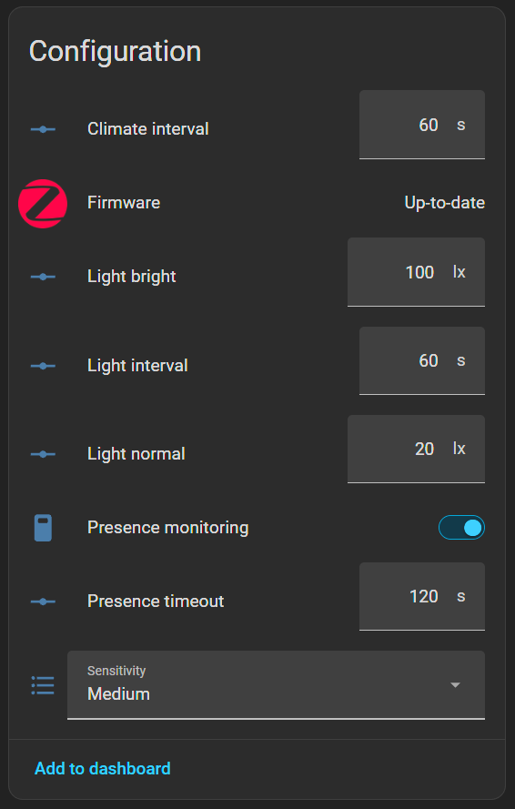
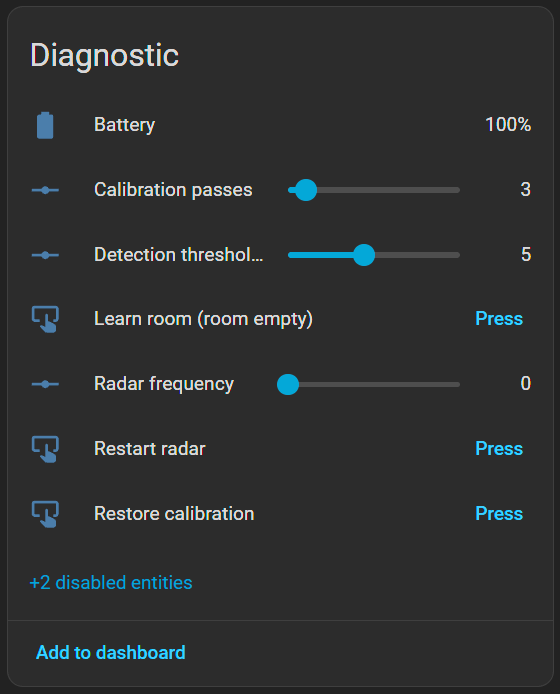
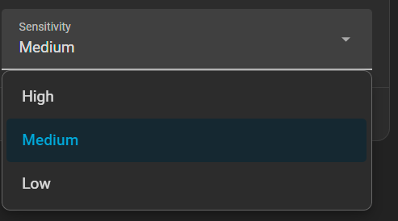
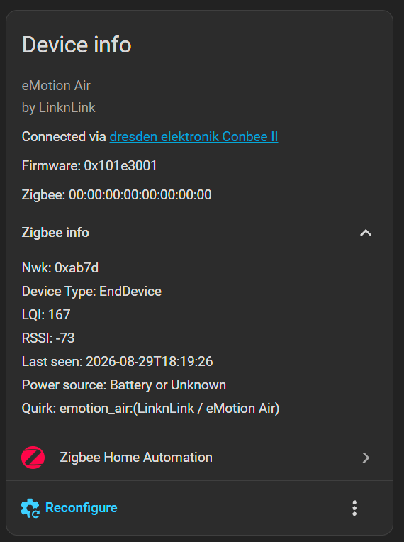

# eMotion Air Zigbee configuration firmware

Patched firmware and a ZHA quirk that let you configure a LinknLink eMotion Air presence
sensor from Home Assistant over Zigbee. Stock firmware exposes those settings over BLE
only, through the vendor app, so they are unreachable from ZHA.

With this you get entities for radar sensitivity, presence timeout, sample intervals and
lux thresholds, reading the device's real current values and writing changes that reach
the radar and persist to flash.

> Not affiliated with or endorsed by LinknLink. "LinknLink" and "eMotion Air" are their
> trademarks, used here only to say what this is compatible with.

---

## Status

Developed and verified against stock firmware v1.1.9, with a ConBee II coordinator and
Home Assistant 2026.8.

| Control | State |
|---|---|
| Sensitivity (High/Medium/Low) | verified on hardware |
| Presence timeout | verified on hardware |
| Presence monitoring switch | verified on hardware |
| Radar frequency | command verified, meaning still unknown |
| Restart radar | verified on hardware |
| Learn room (calibration scan) | verified on hardware, v1.10 |
| Restore calibration | verified on hardware; the vendor feature itself does nothing |
| Raw AT passthrough | verified on hardware, v1.10 |
| Reading real current values | verified on hardware |
| Light and temp/humidity sample intervals | verified against the vendor app |
| Lux thresholds (bright, normal) | verified against the vendor app |

Every control has been driven end to end and watched arriving on the radar's UART:

| Control set to | Command seen on the wire |
|---|---|
| Sensitivity, Medium then High | `AT+TRITH=5`, `AT+TRITH=3` |
| Presence monitoring, off then on | `AT+SLEEP`, `AT+RESET` |
| Presence timeout, 120 s | `AT+HOLD=60` (the firmware halves it) |
| Radar frequency, 2 | `AT+FREQ=2` |
| Learn room, 3 passes | `AT+CALI=3` |
| Raw AT, `AT+HW` | `AT+HW`, verbatim |

The presence-monitoring switch emits a different opcode in each direction, which is the
fiddliest mapping in the quirk. Reports of anything behaving otherwise are welcome.

## What it looks like in Home Assistant

<table>
<tr>
<td width="50%" valign="top"></td>
<td width="50%" valign="top"></td>
</tr>
<tr>
<td valign="top">The settings, in the standard Configuration card.</td>
<td valign="top">The raw controls and one-shot actions, kept in Diagnostic and disabled by default on a fresh install.</td>
</tr>
</table>

Sensitivity "Medium" in the first card and Detection threshold "5" in the second are the
same setting shown two ways. That is the inversion described below.

## What the settings actually do

Home Assistant has no tooltips for these entities and truncates long names in the device
panel, so the names are deliberately short and the explanations live here and in the
quirk's docstring. Rename anything you like in the HA UI.

| Control | Device command | Notes |
|---|---|---|
| Sensitivity | `AT+TRITH=n` | High/Medium/Low select. The raw value runs backwards (see below), which the select hides |
| Presence timeout | `AT+HOLD=<secs/2>` | How long presence stays "detected" after motion stops. The firmware halves it, so the step is 2 |
| Light interval | (no radar command) | Lower means fresher readings and more battery. The firmware clamps anything below 2 s |
| Climate interval | (no radar command) | Same trade-off, clamped below 10 s |
| Light normal, Light bright | one command for both | The lux boundaries the device reports against. A single device command sets the pair, so the quirk composes them. Bright 11 to 60000 lx, normal below it. The vendor app's bright slider runs to 60000 lx with no text entry, which makes precise values nearly impossible; the ranges here are the same but typeable |
| Presence monitoring | on `AT+RESET`, off `AT+SLEEP` | Powers the radar down entirely. No single toggle exists, hence two opcodes. Off also freezes the occupancy sensor, see below |
| Radar frequency | `AT+FREQ=<0..4>` | Meaning unknown, so disabled by default. Probably an RF channel, see below |
| Learn room | `AT+CALI=<n>` | The calibration scan, run with the room empty. Uses the Calibration passes value, default 9 |
| Restore calibration | `AT+INITTH` | The app's "Restore". Measured to change nothing (see below), so do not rely on it to undo a scan |
| Restart radar | `AT+RESET` | Harmless, and also re-enables presence monitoring |

### Sensitivity runs backwards, so this is called a threshold

The device command is `AT+TRITH`, a trigger threshold, while the vendor app labels it
"Sensitivity". They run in opposite directions.

Confirmed against the app on 2026-08-29: selecting "Low" writes 7, and the firmware
default of 3 displays as "High".

| App | Value |
|---|---|
| High | 3 |
| Medium | ~5 (interpolated) |
| Low | 7 |

Lower means more sensitive. The raw scale runs 1 to 10 with no hidden modes: value 10
merely takes a separate code path because the firmware renders the digit as `value + 0x30`,
which only covers 1 to 9.

Rather than expose that trap, the quirk offers a Sensitivity select with High, Medium and
Low to match the vendor app. The raw 1 to 10 value is still there as "Detection threshold
(raw)" under Diagnostic, disabled by default, for fine control. Because the raw scale
accepts values the app cannot express, a device can sit somewhere in between (ours was on
6). The select snaps to the nearest band for display and the raw entity shows the exact
number.



### Radar frequency, and phantom presence with multiple sensors

`AT+FREQ` takes 0 to 4 and its meaning is not documented anywhere we could find. In the
radar's command table it sits with `GAIN` and `HW`, the RF and hardware group, rather than
with the detection thresholds, so the likeliest reading is a frequency point within the
24.00 to 24.25 GHz ISM band: a channel, so that nearby radars do not interfere.

If you run several of these within range of each other and see phantom presence, one
tripping while its room is empty or presence that will not clear, that is the classic
symptom and putting them on different values is worth trying. The entity shows the value
the sensor's MCU stored rather than one read back from the radar, so judge it by
behaviour.

Full reasoning, and the radar's complete AT command set, in
[docs/reverse-engineering.md](docs/reverse-engineering.md).

### What the calibration buttons actually do

Measured on 2026-08-29. The radar reports its per-range-gate thresholds in the status
block it emits on reset, which makes these testable. Pressing each and comparing dumps:

`AT+CALI` rewrote 19 thresholds. The factory ramp (`R1TH=8,7,6,4,4...`) became an
environment-shaped profile (`10,10,6,6...`). This is the real calibration scan, and the
vendor app's "Start detection".

`AT+INITTH` is acknowledged with `AT+OK` and restarts the radar, but left every threshold
unchanged across two restarts. Pressing "Restore" in the vendor app produced an identical
UART signature and identical non-results, which identifies `AT+INITTH` as that button and
shows that the vendor's own restore does not work. It is described as clearing the
per-area calibration and restoring defaults; measurably it does neither.

So there is no working undo for a calibration scan short of a factory reset. If you run
one, run it with the sensor mounted where it will live and the room empty, because you
cannot simply put it back. A scan characterises whatever the radar can see at that
instant, so a person standing in the room teaches it that you are background.

A pass takes roughly 22 seconds, so budget about `passes x 22 s` for a scan.

The three one-shot actions live in their own Diagnostic section, separate from the
settings, and along with the frequency control they are disabled by default. None of them
is destructive and none can brick anything, but the two calibration actions act on
whatever the radar can see at the moment you press them, so they should not be one
accidental click away. Enable the one you want in HA, use it, then disable it again.

Genuinely destructive commands (factory reset, key regeneration, encryption) are refused
by the patched firmware itself and cannot be reached through the quirk at all.

> Upgrading? HA keys each entity's enabled state to its `unique_id` and does not purge
> those registry rows when you delete a ZHA device, so entities you already had come back
> with their previous state. "Disabled by default" only takes effect on a genuinely fresh
> install; on an existing one, disable the buttons by hand once.

## Changes can take minutes to arrive

This is a battery-powered sleepy end device. It does not listen continuously; it wakes on
its own schedule and polls the coordinator for anything queued. ZHA cannot push a setting
to it, only leave one waiting. Observed poll gaps on an idle unit are two to four minutes,
so that is how long a change can sit before it lands.

Two things shorten the wait. Motion is the usual one: the device reports and polls quickly
while the radar is seeing something, so walking in front of it gets a write delivered.

A short press of the button also works, and is the better option when the radar is asleep
and motion is not available. The press sends a ZCL On/Off Toggle, so the device transmits,
and a queued command can go out on the back of it. Observed on 2026-08-30: a write that had
been queued for about 13 minutes was delivered 32 seconds after a button press. That is
correlation rather than proof, but after 13 minutes of nothing it is hard to read as
coincidence.

That leads to one ordering trap worth knowing:

> Change **Presence monitoring** last. Turning it off puts the radar to sleep, which
> removes the motion that keeps the device polling quickly. Any setting you change
> afterwards will be waiting on the slow poll instead, which looks exactly like a write
> that failed.

Finally, a client-side timeout is not a failed write. The value is still queued and will
land. Judge a change by reading it back, not by how the write call returned.

## Presence monitoring freezes the occupancy sensor

Turning Presence monitoring off sends `AT+SLEEP` and the radar stops. Nothing then reports
presence either way, so **the occupancy sensor freezes at whatever it last held** rather
than falling back to clear.

Measured on 2026-08-30: a unit that was occupied when monitoring was switched off held
`on` for the entire watch with the sensor moved away and facing away, while its `last_seen`
kept advancing and its humidity reading changed. The device was talking throughout, so it
was the radar that was off, not the link. With the radar asleep there is no mechanism for
that value to clear.

The consequence is worth thinking about before you use the switch: an automation along the
lines of "turn the lights off when the room is empty" will never fire again, because the
room never becomes empty as far as Home Assistant is concerned. Switching the radar off
does not mean "no presence", it means "no more news about presence".

To leave it in a sensible state, cycle it in the right order: turn Presence monitoring on,
wait for occupancy to report clear, and only then turn it off. The frozen value is whatever
the radar last reported, so make sure that value is the one you want.

Verified on 2026-08-30 on a unit that had latched `on`. Waking the radar took about three
minutes of queued retries, occupancy cleared roughly five minutes after the radar came back,
and switching monitoring off then froze it at `off`, where it stayed. Budget ten minutes for
the whole cycle, most of it waiting on the poll.

## Known issue: writes work, but Home Assistant reports them as failed

You change a setting, HA shows an error, and the control snaps back to its old value. It
looks like the write was rejected.

The write actually succeeds. The shim fires, the command reaches the radar, and the value
is written and persisted to flash, which you can confirm on the radar's UART and by
reading the value back. What fails is only the reply: the device's ZCL layer answers
`UNSUPPORTED_ATTRIBUTE`, zigpy raises, and HA reverts the displayed value.

The quirk handles this. It recognises that specific reply on the specific attributes the
firmware handles out of band, treats it as success, and updates the entity to the written
value. Only `UNSUPPORTED_ATTRIBUTE` on those attributes is forgiven; any other failure
passes through as a real error. If you are running an older quirk, refresh the entity
(Developer Tools, `homeassistant.update_entity`) to see the real value.

The cause is the read path added in firmware v1.9. Registering an attribute table on the
occupancy cluster makes the device's ZCL layer validate writes against that table too. The
attributes we write to are not in it, so it refuses them, after our shim has already acted
on them. Firmware v1.8, which had no such table, returned success.

A firmware-side fix is possible but not implemented. Registering the written attributes as
writable would make the device answer SUCCESS properly, and for most of them the data
pointer can point straight at the matching config offset, where a direct write is harmless:
`0x0010` to `+0x16`, `0xF013` to `+0x18`, `0xF014` to `+0x1A`, and `0xF015` to `+0x1C` (one
u32 covering both lux thresholds, which are contiguous). Sensitivity is the exception. It
occupies bits 3 to 6 of the packed byte at `+0x15`, so a raw ZCL write there would clobber
the frequency and awake bits. It needs a scratch RAM address instead, and a safe one has
not been identified: `+0x00..0x0F` appears to hold key material, the OTA header buffer at
`0x844548` is live during transfers, and the SRAM map shows static data running to roughly
`0x848000` with what look like heap and stack bounds above it. Since the quirk-side fix is
complete and carries no reflashing risk, this is filed as possible rather than pending.

## Raw AT passthrough (v1.10 and later)

The radar understands 58 AT commands and the stock firmware issues about ten. v1.10 adds a
passthrough so the rest are reachable from Home Assistant without another firmware build:

```yaml
action: zha.set_zigbee_cluster_attribute
data:
  ieee: "xx:xx:xx:xx:xx:xx:xx:xx"
  endpoint_id: 1
  cluster_id: 0x0406
  attribute: 0xF0FF
  value: "AT+R8TH=20"
```

The firmware appends CRLF and forwards it to the radar. There is deliberately no entity,
because a free-text command channel to the radar is not something to leave in the UI.
Verified on hardware on 2026-08-29: `AT+HW` sent this way appeared verbatim on the radar's
UART.

The interesting use is range limiting. The radar has ten range gates at 0.7 m each with
individual thresholds, `R1TH` to `R10TH`, plus `MR1TH` to `MR10TH` for moving targets.
Raising the far ones amounts to "stop detecting past 4 metres", which is the usual fix for
a presence sensor that sees through a wall or down a hallway. Neither the vendor app nor
this quirk exposes that directly; the passthrough makes it reachable. Read the current
values from the radar's status dump on its UART, or just experiment.

> `AT+BAUD` is refused by the firmware. The MCU always talks 115200 to the radar, so a
> successful baud change would permanently cut the link with no recovery short of
> replacing the radar. Everything else is recoverable with `AT+RESET`.

## Is this risky?

Less than you would expect, for two reasons.

The device has dual-bank flash. A new image is written to the inactive bank and the boot
flag is only flipped after the device verifies a CRC over the whole image, so a corrupt or
rejected image never runs and the old one stays live.

The button is an unconditional escape hatch. Holding it for about 10 seconds enters BLE
pairing regardless of firmware or configuration, and the BLE flash path has no version
check, so you can always write a stock image back.

It will certainly void your warranty, and nobody but you is responsible for what you
flash. But bricking one beyond recovery is genuinely hard to achieve.

---

## What you need

- An eMotion Air on stock v1.1.9. Other versions will have different offsets, see below.
- A way to flash it. Besides the two paths below, the vendor app's own manual firmware
  update accepts our raw `.bin` without complaint, with no signature or provenance check,
  which is by far the quickest way to iterate during development (about a minute).
- Your own copy of the stock firmware image. This repository ships none, see
  [FIRMWARE.md](FIRMWARE.md).
- The TC32 toolchain to compile the shim:
  ```
  git clone --depth 1 -b linux https://github.com/flyskywhy/tc32.git /opt/tc32
  export PATH=/opt/tc32/bin:$PATH
  ```
  On Windows, run the build inside WSL. The Windows build of that toolchain is broken: it
  hard-links against an ancient `libgcj-13.dll` that is not shipped.
- Python 3.9 or later (`pip install -r tools/requirements.txt`). The BLE tools are
  Windows only.

## Build

```bash
python3 firmware/build.py --base /path/to/your_stock_1.1.9.bin --out emotion_air_patched
python3 tools/verify_ota.py emotion_air_patched.ota 0x10193001
```

That produces `emotion_air_patched.bin` to flash over BLE and `emotion_air_patched.ota` to
serve over Zigbee. `verify_ota.py` re-checks the result against every gate the device
enforces, using independent code from the builder.

## Install over Zigbee (recommended, no physical access)

1. Drop the `.ota` into a directory on your HA host, for example `/config/zigpy_ota/`.
2. Add the local OTA provider to `configuration.yaml`:

   ```yaml
   zha:
     custom_quirks_path: /config/zha_quirks/
     zigpy_config:
       ota:
         extra_providers:
           - type: advanced
             warning: "I understand I can *destroy* my devices by enabling OTA updates from files. Some OTA updates can be mistakenly applied to the wrong device, breaking it. I am consciously using this at my own risk."
             path: /config/zigpy_ota/
   ```

   > That `warning` string must be exact. If it is wrong by a single character, zigpy
   > silently discards the provider: ZHA still loads, config validation passes, and
   > nothing appears in any log. This is the single most likely reason nothing happens.
   > Validate it first:
   > ```bash
   > python3 -c "from zigpy.config import SCHEMA_OTA; SCHEMA_OTA({'extra_providers':[{'type':'advanced','warning':open('warning.txt').read().strip(),'path':'/config/zigpy_ota/'}]}); print('ok')"
   > ```

3. Copy `zha-quirk/emotion_air.py` to `/config/zha_quirks/`, then restart Home Assistant.
   A quirk change needs a full restart; re-adding the device is not enough.
4. Trigger the update from the device's firmware entity.
5. Check it took, on the device page:

   

   `Firmware` is the version you built. A `Quirk:` line naming `emotion_air` means the
   quirk attached; if that line is absent, it did not, and none of the controls above
   will appear.

Expect it to be slow and to need nudging, because this is a battery-powered sleepy device.

- `update.install` often fails first with `NWK_ROUTE_DISCOVERY_FAILED` (asleep) or
  `TimeoutError` (woke, but did not start pulling blocks). Retry it while walking in front
  of the sensor, since motion keeps it in fast-poll. Once blocks flow it self-sustains.
- A full transfer takes roughly 30 to 40 minutes.
- Do not pair other Zigbee devices during the transfer. A join killed one of ours at 99%.

## Install over BLE (fallback and recovery)

```bash
python3 tools/ble_flash.py emotion_air_patched.bin --addr AA:BB:CC:DD:EE:FF        # dry run
python3 tools/ble_flash.py emotion_air_patched.bin --addr AA:BB:CC:DD:EE:FF --go
```

Hold the button for about 10 seconds first to enter BLE pairing. Windows only, using
native WinRT, because `bleak` loses the connection race with this device. Takes about
4 minutes.

## Rolling back

Either path works:

```bash
# over BLE: unconditional, no version check
python3 tools/ble_flash.py your_stock_1.1.9.bin --addr AA:BB:CC:DD:EE:FF --go

# over Zigbee: stamp the stock image with a HIGHER version so ZHA offers it
python3 tools/make_ota.py your_stock_1.1.9.bin stock_restore.ota 0x101D3001
```

The firmware accepts any version that differs from the running one, so a downgrade can be
delivered as an upgrade without touching the hardware.

---

## How it works

Two independent mechanisms, both patched into the stock image. Together they add 784 bytes
to a 215,860-byte image.

Writes go through a small shim that hooks the firmware's global ZCL message callback. When
a Write-Attributes lands on the Occupancy cluster it maps the attribute to the device's own
native command and runs it through the stock dispatcher, which writes the config block,
sends the radar an `AT+` command over the internal UART, and persists to flash. It then
chains to the original callback, so stock behaviour is unchanged.

Reads work by replacing the occupancy cluster's attribute table with a larger one whose
extra entries are read-only pointers into the live config block, so ZHA reads genuine
current values. They are read-only on purpose: a writable pointer would change RAM without
sending the radar command or persisting, producing settings that look applied and silently
are not.

Full detail, including every offset and the traps that cost us hours:
[docs/reverse-engineering.md](docs/reverse-engineering.md) and
[docs/ota-format.md](docs/ota-format.md).

## Other firmware versions

Everything is pinned to stock v1.1.9 (215,860 bytes). `build.py` refuses to patch anything
whose hook pointer and attribute table are not where it expects, rather than producing a
broken image. To port to another build you need to relocate the handful of addresses in
[docs/reverse-engineering.md](docs/reverse-engineering.md). The technique is unchanged.

## Licence

MIT for everything here, see [LICENSE](LICENSE). That covers our code only. The firmware
image you supply remains LinknLink's, is not included in this repository, and must not be
redistributed.
